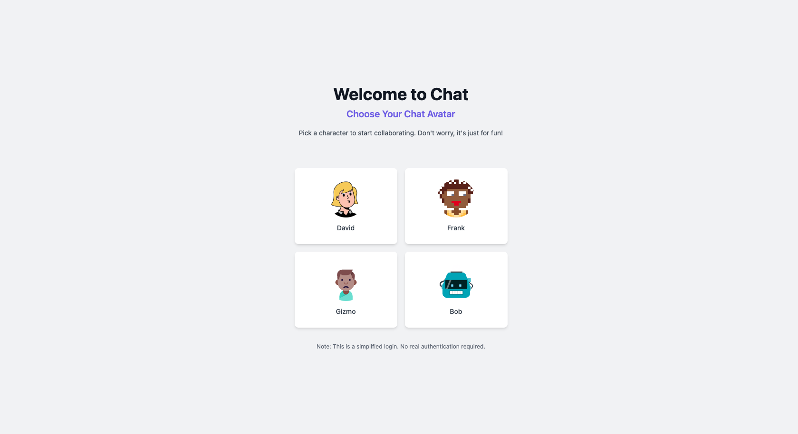
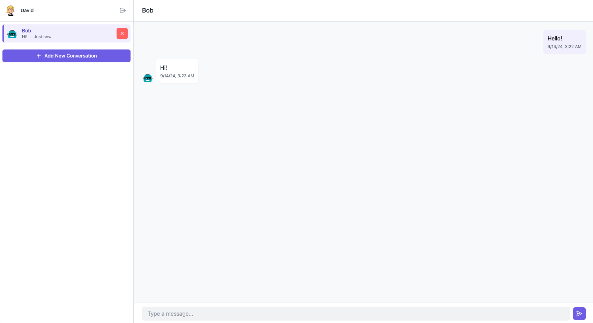

# Chat App (Work In Progress)




## Description

This is a test app to explore and play with web sockets, Nx, Tailwind, RxAngular and zoneless change detection in
Angular. The app is a simple chat application that allows users to create conversations and send messages to each other.
There is no authorization of the user, but you can select predefined users to chat with.

✅ [FUNCTIONAL] Data sync, when switching offline-online<br>
✅ [FUNCTIONAL] Switching tabs is up-to-date<br>
✅ [FUNCTIONAL] Group and signle conversations<br>
✅ [FUNCTIONAL] Change between languages in build time<br>
<br>
✅ [LEARN] RxAngular, Tailwind, RxDB<br>
✅ [LEARN] Nx, Nx Boundaries, DDD<br>
✅ [LEARN] NestJS, Supabase, Socket.IO<br>
<br>
❌ [NO NEED] Authorization is not required<br>
❌ [NO NEED] No focus on system design<br>
❌ [NO NEED] Responsive design<br>

## Features

- **Select Predefined User**: Users can select a user to chat with from a list of predefined users.
- **Send Messages**: Users can send messages to other users in a conversation.
- **Receive Messages**: Users can receive messages from other users in a conversation.
- **View Messages**: Users can view messages in a conversation.
- **View Conversations**: Users can view a list of conversations they are a part of.<br>
  ~~- **Create Conversations**: Users can create 1-1 or group conversations with other users.~~ <br>
  ~~- **Delete Conversations**: Users can delete conversations they are a part of.~~

## Todo

- **Message Drafts**: Users can save drafts of messages they are composing.
- **Dockerize**: Dockerize the application for easy running and deployment.
- **Tests**: Add tests for the frontend and backend applications.
- **Error Handling**: Add error handling for the frontend and backend applications.
- **Conversation Details**: Add details to conversations like the number of messages, participants, etc.
- **Refactor**: Add some fancy linter rules and refactor the code to make it more readable and maintainable.
- **Optimize**: Add virtual scrolling, lazy loading, etc.

## Technologies Used

- **Angular**: Frontend framework for building the user interface.
- **Nx**: Monorepo tool for managing the project.
- **Tailwind CSS**: Utility-first CSS framework for styling the user interface.
- **RxAngular**: Reactive programming library for managing state and side effects.
- **Socket.IO**: Library for real-time web applications using WebSockets.
- **NestJS**: Backend framework for building the server.
- **Supabase**: Backend-as-a-Service for managing the database.

## Getting Started

### Prerequisites

- pnpm
- Nx CLI
- Supabase account

### Installation

1. Clone the repository:
    ```bash
    git clone https://github.com/michalgrzegorczyk-dev/chat-app.git
    ```
2. Navigate to the project directory:
    ```bash
    cd chat-app
    ```
3. Install dependencies:
    ```bash
    pnpm install
    ```
4. Create a `.env` file in the root of the project and add the following environment variables:
    ```bash
    SUPABASE_URL=<supabase-url>
    SUPABASE_KEY=<supabase-key>
    ```
5. Start both apps:
    ```bash
    pnpm start
    ```

### Running the Application

To start the development server:

```bash
pnpm run dev-all
```

## Project Structure

- **apps**: Contains the frontend and backend applications.
- **apps/web**: Contains the Angular frontend application.
- **libs**: Contains shared code and utilities.
- **libs/shared/dtos**: Contains data transfer objects used by the frontend and backend.
- **libs/web/chat**: Contains the core Angular chat feature.
- **libs/web/account**: Contains the Angular account feature that contains info about users.
- **libs/web/shared**: Contains shared code and utilities like auth, design-system or configurations used by the Angular frontend.

## License

This project is licensed under the MIT License. See the `LICENSE` file for details.


todo:
add pnpm exec prettier --write "**/*.{js,jsx,ts,tsx,html}"
